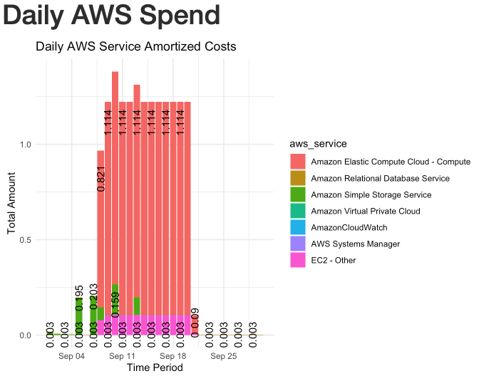

### Daily AWS Costs
My very first attempt at using R to graph daily AWS spend. I find AWS Cost Explorer cumbersome and am annoyed by the number of steps it takes in the UI to graph AWS spend, especially daily spends. Never mind the annoying accidental lockout from the AWS console login that prevents you from logging in. Since I recently started learning R as part of my journey in Data Analytics, I decided to use Python and R to create a graph to track daily AWS spend. The idea is that the Python script runs either as a Lambda function, a CRON job, or locally. Using Boto3, the script collects spending data from AWS and stores it in a table in the PostgreSQL database. Simply use the R Notebook/Knit to view the graph. Now, instead of having to log in to the AWS console, I can use the R Notebook to graph daily spending. It takes mere seconds.

### Requires:
* PostgreSQL Database access, write access to the table that is created using the cost_explorer_db.sql.
* AWS Credentials (aws_access_key_id, aws_secret_access_key )
* Python 3 Packages: see requirements.txt
* [R](https://cran.r-project.org/bin/)
* R Packages: [ggplot2](https://github.com/tidyverse/ggplot2), [RPostgres](https://rpostgres.r-dbi.org), [tidyverse](https://tidyverse.tidyverse.org), [DBI](https://dbi.r-dbi.org)

### Workflow

### R Notebook: ggplot Bar Graph

### PostgreSQL Table with AWS Cost Explorer Data

