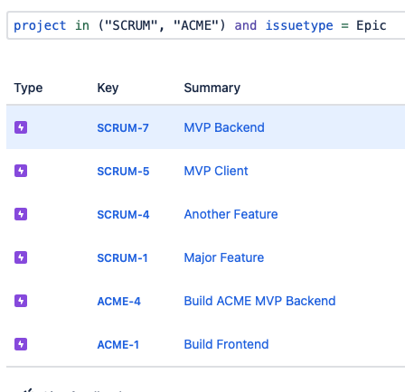
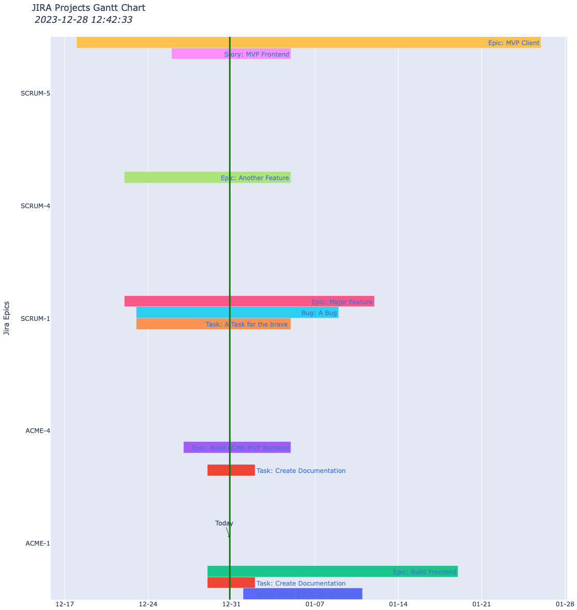
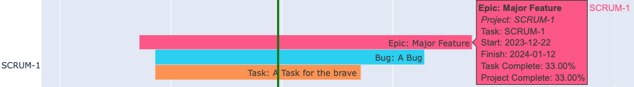
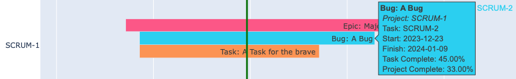
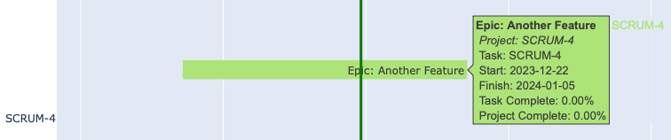
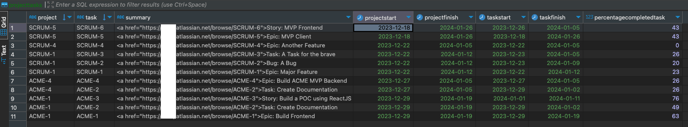

### A lightweight gantt chart using EPICS and Projects in JIRA Cloud
For several years, particularly since assuming leadership roles across multiple Engineering functions, I have aspired to create a streamlined dashboard offering a comprehensive overview, akin to a 50,000-foot view, of timelines encompassing ALL EPICS/Issues across key projects within JIRA. In the early days of computing, MS Project was the go-to tool. In the SaaS era, options range from a manual approach, demanding proficiency in JQL and chart creation in spreadsheets, to the use of costly third-party tools like Asana, Monday, or ClickUp. Somewhere in between, JIRA introduced the 'Roadmap' feature (now called Plan) within individual Jira projects.

However, the JIRA Roadmap feature came with a caveat—it was confined to a single project. To extend roadmaps across multiple Jira projects, an upgrade to the premium version was necessary. The cost of JIRA Premium, depending on the license type and user tier, varied from a minimum of around 2000 USD to tens of thousands of dollars. In situations where a single user or a small team sought a high-level view of project timelines, the JIRA Premium option proved cost-prohibitive, and the manual approach was both time and resource-intensive.

Having previously delved into Atlassian product APIs, I always aspired to construct a dashboard without the need for manual query execution, data filtering, spreadsheet updates, or chart creation. Recently, my foray into data analytics led me to develop a basic yet effective daily spend bar chart using AWS-CLI, R, PostgreSQL, and Python. Building on my past familiarity with JIRA APIs, I subsequently crafted a straightforward Project Roadmap/Gantt chart using Pandas, Plotly, and Python.

The resulting Gantt chart, organized by EPIC, is exported as a JS/HTML file. Currently, the chart displays Jira EPICs on the Y-axis and the timeline on the X-axis. Each bar's label includes the Jira issue type and a concise summary. Hovering over a bar reveals additional details, such as the associated EPIC, project start and finish dates (ignoring issues lacking these dates), and the task and EPIC's completion percentage. It's noteworthy that, given an EPIC is also considered an issue, the completion percentage for the EPIC and the project always align. The Gantt chart also features a vertical marker line indicating today's date.

My enthusiasm for this project prompts me to enhance its interactivity, striking a balance that allows for sufficient detail while leveraging the JIRA UI for deeper exploration when needed.

### Requires:
    1. PostgreSQL login - with create table/truncate/select/update access
        create table: jira_gantt_table.sql
    2. Python packages - see requirements.txt
    3. Valid JIRA Cloud Account
    4. [JIRA Personal Access Token](https://support.atlassian.com/atlassian-account/docs/manage-api-tokens-for-your-atlassian-account/)
    5. Update *setup.config* (rename setup.config.template as setup.config) with login/access information
    6. Update ** PROJECTS global list with JIRA Projects

### How-to Run:
    >./jira_gantt.py
    INFO:root:Following tickets are missing start or due dates ['SCRUM-7', 'SCRUM-11', 'SCRUM-8', 'SCRUM-9', 'SCRUM-10', 'SCRUM-7']

### Examples
* Jira Issue Dashboard 
* [Output JS/HTML: Download and open the file in a browser](./jira_gantt.html)
* Main Screenshot 
* Jira EPIC with linked/children issues 
* Jira linked/child issue 
* Jira EPIC without any linked issues 
* PostgreSQL Table 

