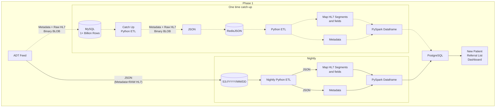

```mermaid
flowchart TD;
    subgraph "Phase 1"
    A["ADT Feed"] -. "Metadata + Raw HL7 
    Binary BLOB" .-> id1[("MySQL
    1+ Billion Rows")];
    subgraph "One time catch-up"
    id1 .-> G["Catch Up Python ETL"];
    G["Catch Up 
    Python ETL"] -. "Metadata + Raw HL7
    Binary BLOB" .-> M["JSON"] .-> H[("RedisJSON")] 
    N .-> I["Map HL7 Segments
    and fields"]
    H .-> N["Python ETL"]
    N .-> J["Metadata"]
    I .-> K["PySpark Dataframe"]
    J .-> K
    end
    K .-> F
    A -- "JSON
    (Metadata+RAW HL7)" --> id2[(S3://YYYY/MM/DD)];
    subgraph "Nightly"
    id2 --> B["ETL"];
    B["Nightly Python ETL"] -- JSON --> C["Map HL7 Segments 
    and fields"];
    B["Nightly Python ETL"] -- JSON --> D["Metadata"];
    C --> E
    D --> E["PySpark Dataframe"]
    end
    E --> F["PostgreSQL"]
    F --> L["New Patient 
    Referral List
    Dashboard"]
    end
```